# 16-833 SLAM Project: Dynamic Object Removal With ORB_SLAM2
**Group members:** Di Deng, Radhika Mohanan, and Samiran Gode
### Project Description
We integrate image segmentation result with [ORB_SLAM2](https://github.com/raulmur/ORB_SLAM2) to remove extracted ORB
 features on dynamic objects based on objects' category. In this project
 , walking people are used to illustrate the effectiveness of the proposed
  method. 
### Prerequisites
We have tested the code with Ubuntu 18.04.
### Licence
The licence of this repo follows the licence of [ORB_SLAM2](https://github.com/raulmur/ORB_SLAM2).
### Simulation Environment
- The simulation environment is from UnrealEngine MarketPlace [Modular
 School Pack](https://www.unrealengine.com/marketplace/en-US/product/modular-school-pack)
- The walking character, Brian, is downloaded from Adobe [mixamo](https://www.mixamo.com/#/).
<div align="center">
    <a href="https://github.com/AndieDeng/dynamic_feature_removal_ORBSLAM2">
      
   </a>
</div>

### Dynamic Object Extraction from Semantic Images
<div align="center">
  <a href="https://github.com/AndieDeng/dynamic_feature_removal_ORBSLAM2">
    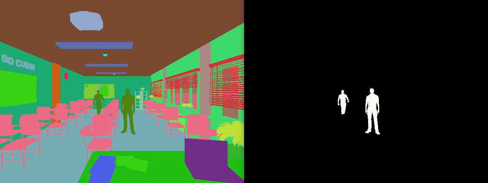
  </a>
</div>

### Feature Extraction with Dynamic Object Removal and Pure ORB Feature Extractor
Features obtained from ORB feature extractor:
<div align="center">
  <a href="https://github.com/AndieDeng/dynamic_feature_removal_ORBSLAM2">
    
  </a>
</div>
Remove features on dynamic object:
<div align="center">
  <a href="https://github.com/AndieDeng/dynamic_feature_removal_ORBSLAM2">
    
  </a>
</div>


### Execution Steps
1. Install [ORB-SLAM2](https://github.com/raulmur/ORB_SLAM2)
2. Replace **src** and **include** folders with the files in this repo.
3. Download [dataset](https://drive.google.com/file/d/1u1_RCT9D_IK9NRLC6WmBBP8inprQFCbZ/view?usp=sharing) and put
 it within the main directory.
3. Run:
```
chmod +x build.sh
./build.sh
./Examples/Monocular/mono_dynamic_airsim Vocabulary/ORBvoc.txt Examples/Monocular/airsim.yaml dynamic_obstacle_dataset
```
You can find that all features on dynamic objects are removed using this code
 comparing to the features extracted directly using ORB-SLAM2.
 
 Features obtained from ORB feature extractor:
 <p align="left">
   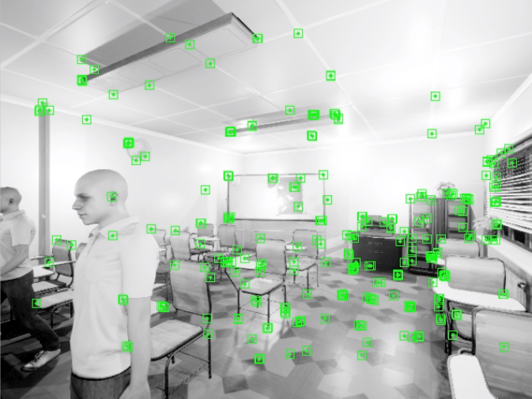
   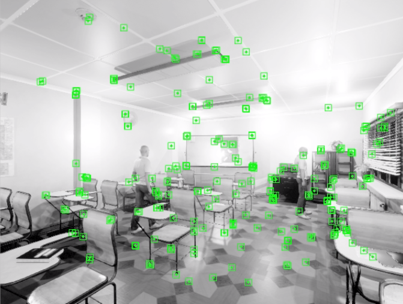
   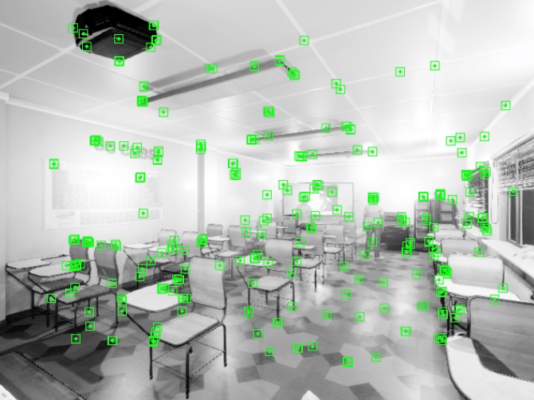
 </p>
 Remove features on dynamic object:
 <p align="left">
   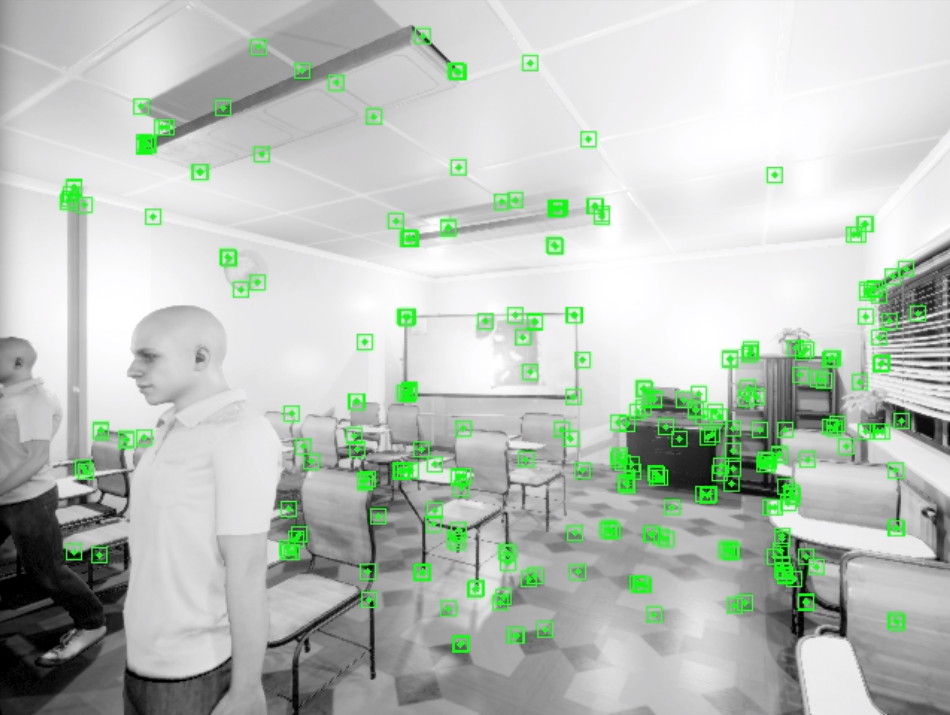
   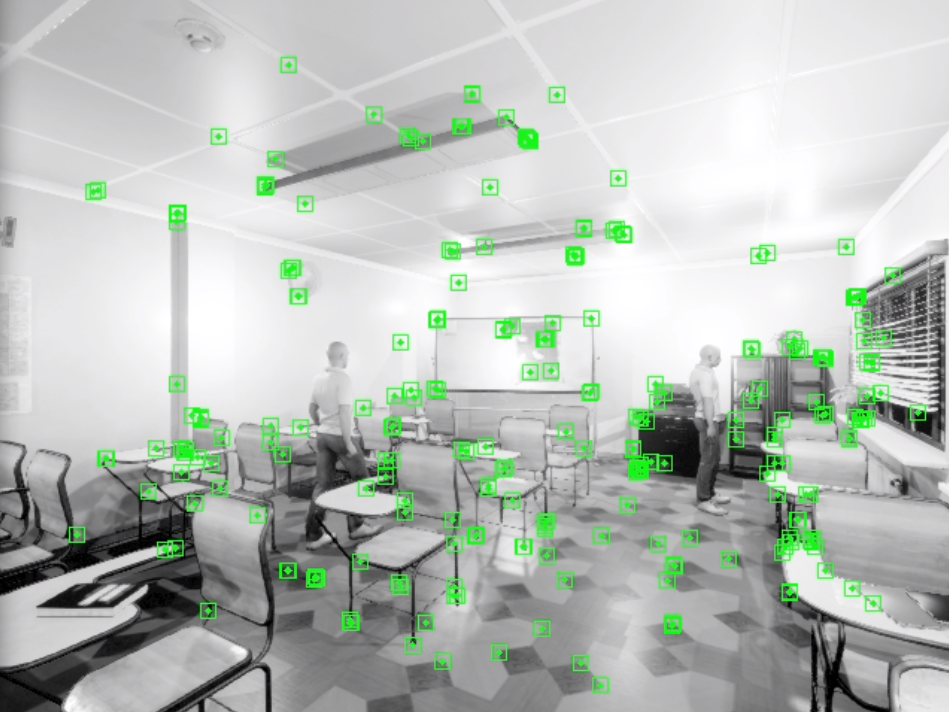
   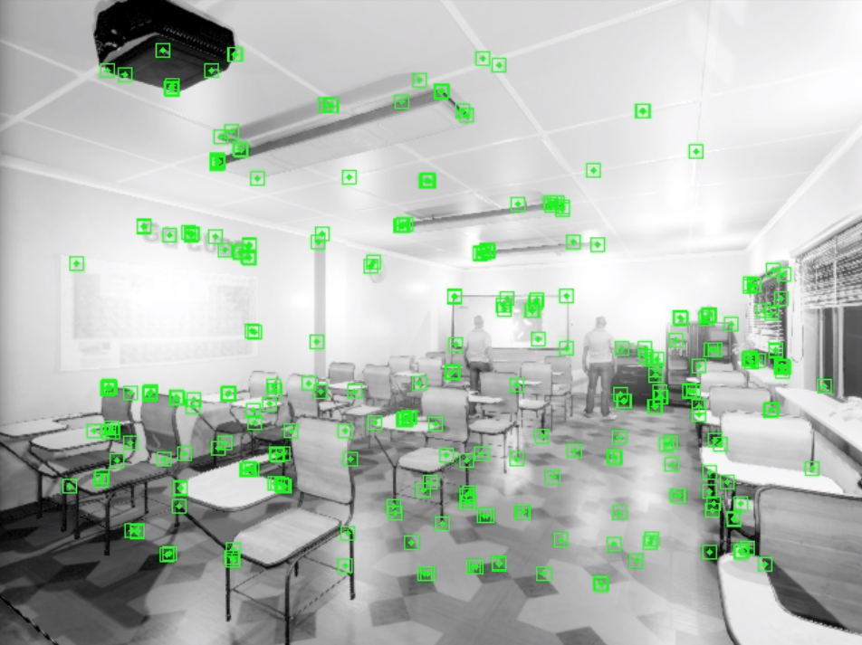
 </p>
 
### Future Work
This [dataset](https://drive.google.com/file/d/1u1_RCT9D_IK9NRLC6WmBBP8inprQFCbZ/view?usp=sharing) also contains
 depth images and the ground truth pose information. We
  want to integrate depth and semantic information with the estimated camera
   trajectory to reconstruct the voxel map of the environment without the
    dynamic objects.
     
   Reconstructed pointcloud based on the ground truth pose information.
   <p align="left">
     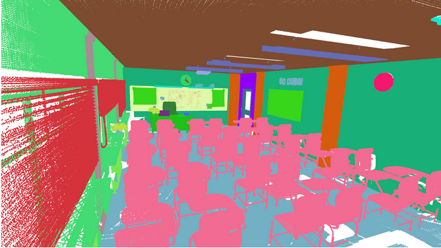
     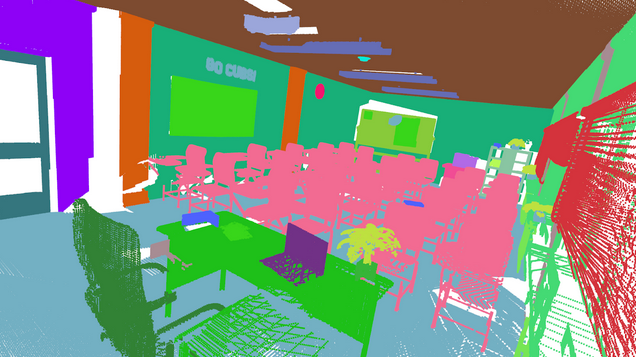
   </p>
   Reconstructed voxel map based on the semantic point-cloud of the environment.
   <p align="left">
     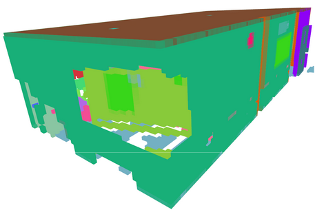
     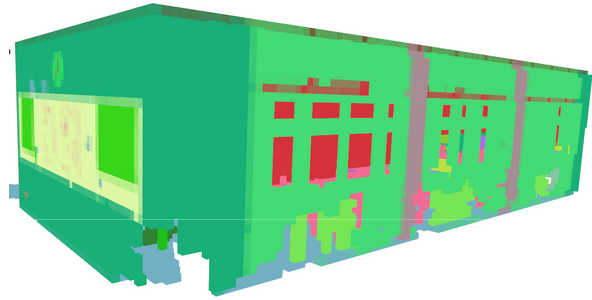
   </p>